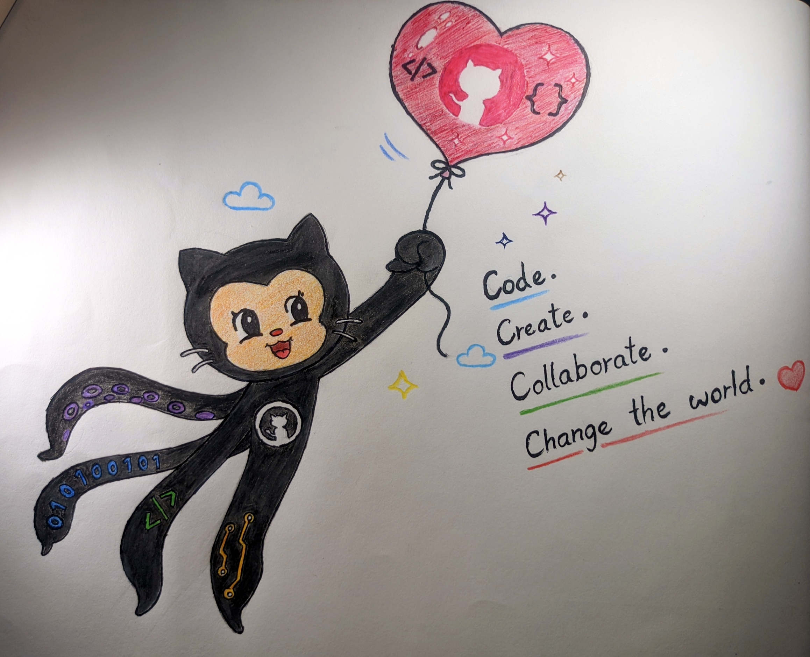

# Commit to Creativity 🎨💻

This project is a hand-drawn GitHub Octocat artwork created for a creative GitHub challenge.

The artwork represents:
- Creativity
- Coding
- Collaboration
- Open-source innovation

Different tentacles include technology-inspired elements like:
- Binary code
- Programming symbols
- Circuits
- Creative patterns

The heart balloon symbolizes ideas and imagination connecting people around the world through technology and open source.

## Artwork Preview

Created with traditional hand drawing and colors.
